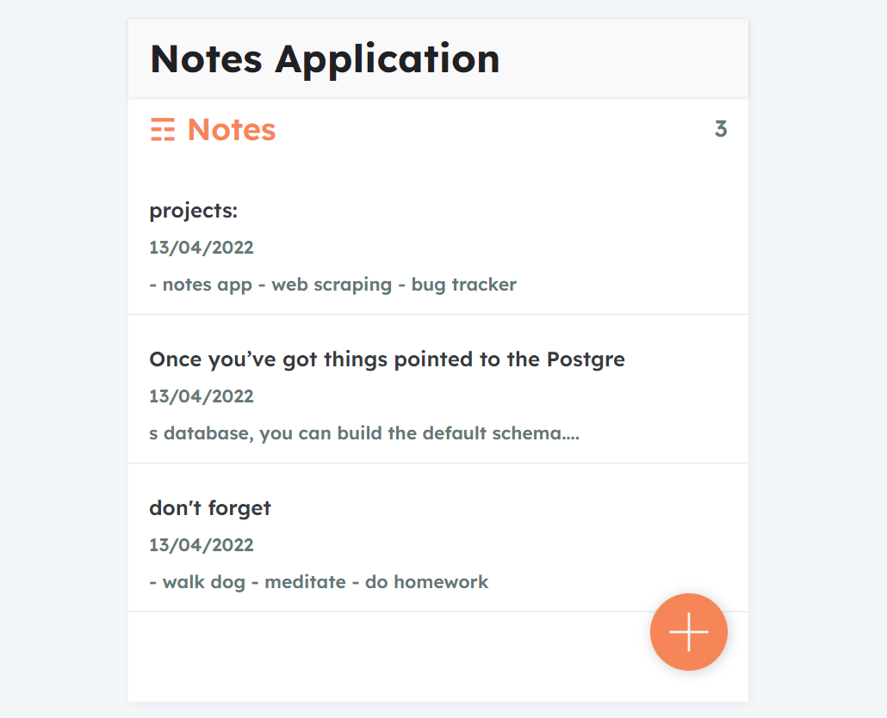
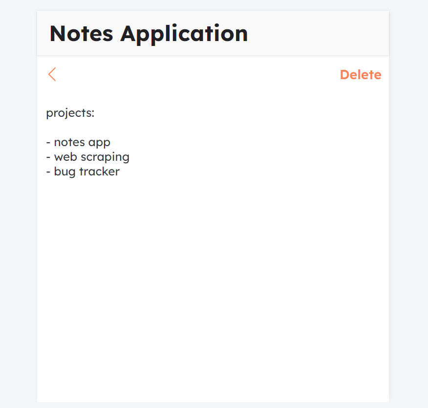

# Notes-application
With Notes application, it is possible to save text notes.

<h1> Screenshots </h1>

- View list of notes. 
- Add new note.

- View a note.
- Write a new note.
- Update a note (Updated note is saved by clicking back arrow.)
- Delete an existing note (An empty note is automatically deleted.).

